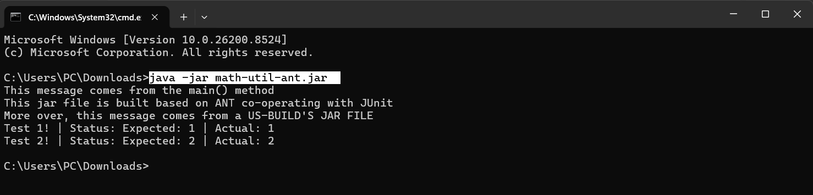

### You will find in this repo the following stuff:

- The MathUtil.java - a replication of the famous JDK's library
  java.util.Math
- Unit Test script using JUnit framework
- Build script using Ant build tool in association with JUnit validation
- ...

#### Screen-shots

#### Connect me via phao9350@mail.com

#### Copyright &#169; 2026 thienhao05
