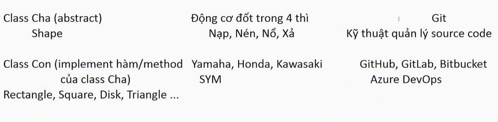

# Quy trình CI - tích hợp liên tục - Continuous Integration

- **Tích hợp (integration)**: ta chỉnh sửa, thêm bớt, bổ sung, fix bug trên code chính
  việc chỉnh sửa thêm bớt code phải đảm bảo chất lượng
  code đc chỉnh sửa và chỉnh sửa chất lượng thì sẽ đc ghi nhận
  lưu vào trong project -> TÍCH HỢP
  TÍCH HỢP: mình gom code **có chất lượng** từ anh em trong team
  gộp/ đầy lên/ upload/ lưu trữ

- **Liên tục (continuous)**: công việc gom code có chất lượng này diễn ra liên tục vì anh em
  dev team hàng ngày vẫn tiếp tục làm dự án, viết code và chỉnh sửa

**TÍCH HỢP LIÊN TỤC** NGHĨA LÀ THU GOM CODE CÓ CHẤT LƯỢNG TỪ PHÍA ANH EM
DO ANH EM HÀNG NGÀY CỨ ĂN CƠM CTY VÀ VIẾT CODE; LIÊN TỤC ĐC GOM CODE
VÀ CẤT VÀO 1 KHO LƯU TRỮ

- Thế nào là code có chất lượng ???
- Code có chất lượng là code mà các hàm/các method/class đc test kĩ càng
- Test code = cách nào:
  - dùng mắt mà dò EXPECTED == ACTUAL hay ko????
  - dùng màu XANH ĐỎ, chơi trò Unit Testing Framework

---

- Code có chất lượng là code mà các bộ test sẽ ra màu XANH, XANH cho tất cả các CASES
- khi viết code tạm xong/đang viết cx đc, chạy ngay bộ test case để xem XANH ĐỎ!!!
  => BIẾT CODE CÓ CHẤT LƯỢNG NGAY!!!

- COI NHƯ CODE ĐÃ CÓ CHẤT LƯỢNG, THÌ VIỆC TIẾP THEO LÀ ĐÓNG GÓI, .JAR, .WAR
  SẼ CẦN XUẤT HIỆN - Mặc định ANT trong NetBeans, gọi qua NB, thì quá trình đóng gói .jar, .war ko đếm xỉa, ko quan tâm
  code đang XANH hay ĐỎ, nó chỉ quan tâm, code ko ERROR về cú pháp/syntax là nó cho ra .jar .war
  - Quá trình đóng gói và quá trình XANH ĐỎ là 2 thứ độc lập nhau, ko ràng buộc!!!
    ANT qua NB chỉ tìm cách từ .jar -> .class -> .jar, ko care JUnit/Unit Test - Code đang đỏ vì JUnit, thì nó vẫn nhắm mắt cho ra .jar
    => KO ỔN, CODE ĐANG BẤT ỔN, TẠI SAO LẠI CHO RA .JAR .WAR
    VIỆC NHẸ LƯƠNG CAO, KÌ VỌNG CÓ VẤN ĐỀ

MÀU ĐỎ MÀ CHO RA .JAR, .WAR LÀ KO ỔN

- TA NÂNG CẤP THÊM QUY TRÌNH ĐẢM BẢO CHẤT LƯỢNG CODE THEO CÁCH/TƯ DUY
  - Code có chất lượng thì phải có Unit Test/Test Case đc check ra MÀU XANH
  - CHỈ CODE CÓ CHẤT LƯỢNG, CODE CÓ MÀU XANH MỚI ĐC RA FILE .JAR .WAR
    ngầm thừa nhận rằng, việc viết code ngon, sẽ đc tích hợp, đc lưu trữ lên kho chung

- TA CẦN GÀI 1 HỢP ĐỒNG NƯƠNG TỰA, KHI ĐÓNG GÓI APP, KHO GỌI ANT
  THÌ CẦN ĐẢM BẢO UNTI TEST ĐANG LÀ MÀU XANH
  UNIT MÀU ĐỎ, ANT CHỬI LUÔN, BUG RỒI, ÉO RA ĐC FILE .JAR

- Chất lượng XANH ĐỎ không chỉ đúng 1 mình mà phải tham giao vào quy trình đóng gói
- GÀI JUNIT/UNIT TEST VÀO CHƠI VỚI ANT
  file đặc biệt: build-impl.xml dòng 1005, 1030 hay 1204, 1229 tùy máy, tùy NetBeans
  sẽ giúp 2 đưa nương tựa nhau!!!

Từ mình chỉnh sửa, thì nó đã test hết tất cả các trường hợp cho mình luôn rồi

- CODE ĐẢM BẢO CHẤT LƯỢNG ĐỂ RA BẢN BUILD .JAR .WAR KO CHỈ ÁP DỤNG
  CHO TỪNG DEV MÀ PHẢI ÁP DỤNG CHUNG CHO CẢ PROJECT
  DEV NÀO CŨNG PHẢI TUÂN THỦ QUY TRÌNH NÀY!!!
  CÁC DEV THÌ ĐANG LÀM TRÊN MÁY LẺ/MÁY CỦA RIÊNG HỌ, VẬY SAO ÉP CHUGN HỌ ĐC

- TA SẼ TRIỂN KHAI VỤ ANH NƯNG TỰA, ANT + JUNIT THAY VÌ TRÊN MÁY LẺ
  CỦA TỪNG DEV, TA GOM
  - CODE CỦA CÁC DEV VỀ 1 SERVER CHUNG
  - CHẠY ANT/BUILD TOOL ĐỂ CHECK THỬ XEM TOÀN BỘ TEST CASE CỦA
  - TẤT CẢ CÁC ANH EM CÓ XANH HẾT HAY KO
  - TÍCH HỢP CODE NGON THÌ MỚI CHO
  - CI TẤT CẢ CÁC TEST CASE PASS RỒI, KO THÌ CHỬI
  - CODE LIÊN TỤC ĐƯỢC KIỂM TRA TRÊN SERVER, ĐỂ ĐẢM BẢO BIẾT ỔN HAY KO
  - XANH COI NHƯ CODE ỔN, VIỆC GOM CODE ĐÃ HOÀN THÀNH, TÍCH HỢP THÀNH CÔNG
  - ĐỎ, BỐ KHỈ, BUG RỒI, CHỬI NGAY KU DEV ĐƯA CODE ẨU!!!

## CI XUẤT HIỆN: Liên tục kiểm tra code anh em up lên để đảm bảo code màu xanh

- Khi nó nằm trên server, tích hợp code mới thành công với code cũ
- nếu đỏ, phát hiện ngay từ sớm, chửi ngay để fix
- ko muốn thấy code trên server ẩu, ko chất lượng
- code phải màu xanh trên server, tích hợp thành công các module code

* ĐỂ LÀM ĐC QUY TRÌNH NÀY, LÀM TỰ ĐỘNG LUÔN CẦN:

1. 1 kho chứa code xịn sò: Git server (GitHub, GitLab, Bitbucket...)
   Git là abstract class, interface còn 3 thằng kia là 3 thằng implement
2. Có 1 Tool, đồ chơi, 1 công cụ, lắng nghe sự thay đổi code trên server (listener)

- (Nghe xem có ku dev nào vừa đưa code lên server, push, upload)
- Lắng nghe, thấy có thay đổi, đi méc ngay Build Tool: Ant, Maven, Gradlen
  nhờ mấy Build Tool check giùm code, check luôn cả Unit Test Script

3. Check xong, thấy XANH -> im thoy
   thấy ĐỎ -> BẮN MAIL CHỬI KU VỪA UP CODE

- Tool lắng nghe: Jenkins, Bamboo CI, Team City, Circle CI, Travis CI
  - Github Actions (lớp này)
  - Azure DevOps

4. Git Client Tool để upload code lên server!!!

CI/CD/DevOps

---

NHẬP MÔN (GITHUB, GITLAB, BITBUCKET)

- ĐỀU LÀ GIT
- GITHUB, GILAB, BITBUCKET LÀ CLASS CON CỦA GIT, KHI MÀ CON SẼ THỪA HƯỞNG NHỮNG ĐẶC TRƯNG CỦA CHA

### Class Cha (abstract) :

Động cơ đốt trong 4 thì | Git
Shape | Nạp, Nén, Nổ, Xả | Kỹ thuật quản lý source

### Class Con (Implement hàm/method Yamaha, Honda, Kawasaki, SYM của class Cha) | GitHub, GitLab, Bitbucket, Azure DevOps

Rectangle, Square, Disk, Triangle

4 thằng này xài lý thuyết chung nạp nén nổ xả

- Học GitHub thì mình có thề xài được GitLab, Bitbucket

Git và câu chuyện của quản lý source code (cho dev team)
Git là 1 công nghệ, kỹ thuật Quản lý source code, quản lý các phiên bản code (sự thay đổi của code)
Quản lý source code là gì ? là những app/công nghệ/kỹ thuật để..

- _SCM_: Source Control Management System
- _VCS_: Version Control System
  kèm thêm chữ: Distributed/Distribution - phân tán
  Centralized - tập trung

Mạng: Git là phân tán
Subversion là tập trung

Quản lý source code/ quản lý phiên bản/ quản lý sự thay đổi của source gồm những việc gì ???
(Abstract)

- Lưu trữ source code của anh em dev team (~drive - Google Drive, One Drive~)
- Lưu vết/ tracking sự thay đổi của source: ai sửa gì thêm bớt gì, có cái gì bị overwrite hay ko
  -> quản lý các version, history để khi cần ta có thể UNDO, ROLLBACK, REVERT
- Copy & Paste cái dự án đã ổn định nhưng ta muốn thử nghiệm thêm, chỉnh sửa thêm,
  tối ưu thêm, hoặc là nâng cấp thêm tính năng nhưng lại ko muốn đụng vào code gốc, việc quản lý source này có thêm tính năng/chức năng cho phép CLONE/COPY&PASTE, BRANCH project đang ngon thành 1 phiên bản thử nghiệm, khi phiên bản thử nghiệm ổn -> MERGE ngược lại bản ổn định nếu ko ngon, xóa đi mà ko ảnh hưởng đến code gốc, code ngon

- Nếu 2 nhiều developer lỡ đè code của nhau hệ thống cần phải phát hiện điều này; hoặc hệ thống phát hiện sự ko đồng bộ giữa code của các anh em trong team khi đồng bộ lên server
  - ví dụ: server có ABC
    - máy Dev 1: có code đang là ABC; Dev 1 thêm mới D, đưa lên server thành ABCD
    - máy Dev 2: có code đang là ABC; Dev 2 thêm mới E, đưa lên server thành ABC?????
    - ABCE(2)
    - ABCDE (1 2)
    - ABCD (1)

CONFLICT XUẤT HIỆN DO SỰ KO ĐỒNG BÔ Ở KHO CHỨA CODE CHUNG
TOOL VCS, SCM PHẢI KO ĐƯỢC ĐIỀU NÀY

Lịch sử đã có tool làm điều này: tên là SUBVERSION, nhưng có nhược điểm là CÔNG NGHỆ CENTRALIZED, 4 TÁC VỤ TRÊN CỦA 1 CÁI VCS, SCM được cất ở Server chung.

Server sập, thì mất luôn việc theo dõi phiên bản!!!!

Git sinh ra làm 4 việc trên, nhưng phân tan 1cai1 server về các máy local

- Mỗi máy của dev đều có 1 phiên bản của cái server chứa code chung của anh em; toàn bộ sự thay đổi trong code của anh em thì được lưu ở 2 nơi
- server chung và máy anh em
  -> PHÂN TÁN RA ĐỜI, GIT LÀ PHIÊN BẢN, KỸ THUẬT QUẢN LÝ SOURCE CODE THEO STYLE PHÂN TÁN
  phân tán nhật ký thay đổi của dev team trên server đem về máy dev team cất đề phòng sự cố server

Git ra đời thế nào ??? Dính đến 1 đã tên là: **Linus Torvalds**

- Lấy OS Unix làm mẫu, clone lại nó ở góc độ nhỏ gọn hơn
- Linus
- x
  -> Linux, open-source, chia sẽ code OS này với dân mạng
  -> Ubuntu, Fedora, Debian, RedHat, CentOS....
  source Linux cất ở đâu??? có máy để cất trữ
  BitKeeper cho để code Linux miễn phí cho đến năm 2005
  họ ko cho miễn phí nữa,....
  Linus bực mình
  sau vài tháng tu luyện, công bố Git là kĩ thuật/công nghệ quản lý source đáp ứng tất cả 4 điều cần có của SCM VCS.

=> open công nghệ này
-> các cty khác dùng Git để dựng lên những server cho thuê ko gian chứa và quản lý source
-> GitHub, GitLab, Bitbucket ra đời (Thương mại kiếm tiền)

CHƠI VỚI GITHUB ĐỂ ĐƯA CODE LÊN SERVER (GITLAB, BITBUCKET TƯƠNG TỰ) CẦN GÌ ?

1. CẦN 1 ACCOUNT TRÊN SERVER CODE GITHUB, GITLAB, BITBUCKET

- dùng email cá nhân để đăng kí
- Chọn url/đường dẫn cho GH của mình đủ đẹp, ý nghĩa, dễ đọc, chữ thường hết

- Vào mục Settings/Account đổi URL

2. TẠO 1 KHO ĐỂ CHỨA CODE CẢU DỰ ÁN, CODE DỰ ÁN LÀM Ở MÁY DEV VÀ ĐC UPLOAD LÊN SERVER

- Tạo kho trống 100%, tránh conflict khi upload lần đầu, và bối rối ko biết xử lý
- Kho chứa code ~~~ tương đương 1 folder, 1 thư mục - REPOSITORY - REPO
- Kho chứa code đc đặt tên để phân biệt với kho khác

* Quy ước:

- Tên kho chữ thường, trung 100% HOA THƯỜNG VỚI TÊN PROJECT SẼ UPLOAD
- Tên kho trên server trùng 100% tên app/project
- Thuận tiên cho quá trình CI, download project/kho là như nhau, về build luôn
- Nếu đặt chữ thường, dấu cách phân biệt các từ -> khi build nó ra tên tập tin chữ thường
  sẽ y chang như tên các thư viện trên mạng
  ví dụ: tên kho là: math-util-ant, tên project cũng vậy luôn
  - Khi build dựa án thì ra math-util-ant.jar

- KHO MÌNH TẠO Ở GITHUB/SERVER NẰM TRÊN MẠNG, ĐC GỌI LÀ KHO Ở XA
  CHỨA CODE TRÊN CLOUD/MÂY/MẠNG/TRÊN GITHUB SERVER
  CÒN GỌI LÀ KHO "REMOTE"

3. CHUẨN BỊ SẴN 1 PROJECT Ở MÁY DEV/MÁY LOCAL VÀ SẴN SÀNG ĐỒNG BỘ LÊN, REMOTE, UPLOAD SOURCE LÊN SERVER
   CŨNG CÓ THỂ DOWNLOAD SOURCE VỀ LOACL

- Đã có project làm rồi, tên trùng 100% tên kho remote

4. PROJECT Ở LOCAL CẦN XEM XÉT, AI SẼ ĐI LÊN SERVER, AI SẼ Ở LẠI LOCAL
   project viết bằng ANT, dùng ANT để build ra .JAR, .WAR thì:

- có folder tên là: dist/build/ 2 đứa này ko cần đem lên server
  cất source .java mới quan trọng, vì nó dùng để tạo ra .jar

Project viết bằng MAVEN, dùng MAVEN để build ra .JAR, .WAR thì:

- Có folder tên là: TARGET/ chứa .jar .class -> ko cần đem lên server

Git hỗ trợ 1 khái niệm: LỰA CHỌN AI TRONG PROJECT/THƯ MỤC TẬP TIN NÀO ĐC LÊN SERVER, THẰNG NÀO Ở LẠI

Hãy chỉ cho Git biết ai PHẢI Ở LẠI TRONG FOLDER PROJECT LIỆT KÊ TÊN ĐỨA ĐÓ TRONG 1 CÁI FILE TÊN LÀ .GITIGNORE

CÓ 1 GÃ THẤU HIỂU RẰNG LÀM FILE .GITIGNORE KHỔ CỰC VÌ PHẢI BIẾT TOOL GÌ NÊN BỎ THƯ MỤC GÌ ?

Gã này đã làm ra 1 API, gọi API này, truyền cho API này tên Tool ta đang dùng để code tên loại dự án dùng lưu code/build code, ví dụ maven

-> API trả cho ta cái file .gitignore

-> url: gitignore.io

Có 3 loại Git Client Tool khác nhau, lõi là giống nhau - đầu là lệnh Git

- 1. GUI tool đc tích hợp sẵn trong IDE (NetBeans chính là Team/Git)

* dùng mouse + form nhập -> ra lệnh đưa code lên

- 2. download 1 GUI Tool khác, ví du: Git windown, Sourcetree

* Dùng mouse + form nhập

- 3. Dùng cmd/terminal gõ lệnh mới ngầu và pro. cần cài tool git cmd

* cài thêm bộ lệnh git để gõ cửa sổ cmd/terminal

-> google gõ: Git SCM download

6. Đưa code lên trên github server

- 1. Chuẩn bị 1 kho rỗng trên server/github trên trùng 100% tên project

- 2. Cài tool git scm để gõ lệnh đưa code từ máy tính (Local) lên server (Remote)
- 3. Cấu hình thông tin/Account để đồng bộ code
- 4. Khởi động dự án Local
- 5. Đưa code lên - đồng bộ

**\*** 1. Những lệnh chỉ làm 1 lần duy nhất, và chỉ gõ lại khi

- cài lại Windows
- Mượn máy khác để dùng GitHub
- Đổi thông tin login vào GitHub: ví dụ đổi email, đổi url, đổi pass

* LỆNH

git config --global user.name <nick-git-hub-loại-bỏ-tên-miền-git-hub>

ví dụ:

git config --global user.name doit-now

git config --global user.email <email-login-vào-git-hub>

pass chưa cần cung cấp, lát hồi push code, đồng bộ code từ local lên server
sẽ bị hỏi, Windows sẽ remember luôn ko bị hỏi lại lần sau

2 lệnh này đứng ở đâu gõ cũng dc, ko cần đứng ở project

**\***2. NHỮNG LỆNH CHỈ LÀM 1 LẦN VỚI 1 PROJECT MỚI - Cứ khi nào tạo mới Project, chuẩn bị đưa lên server/GH thì gõ lại lệnh này - CHỈ KHI TẠO MỚI PROJECT!!!

- LỆNH
  git init //khởi động 1 kho ở local, lưu giữ sự thay đổi của source code
  //của bạn, back-up sự thay đổi/nhật ký thay đổi
  //của toàn dự án, toàn bộ team ở trên GH về máy local
  //chính là PHÂN TÁN - DISTRIBUTED SCM
  BẮT BUỘC PHẢI ĐỨNG Ở THƯ MỤC CHỨA CODE/PROJECT
  GH sẽ tạo ra 1 thư mục/folder ẩn tên là .git/dùng chứa nhật ký thay đổi source code của tất cả cả team menber, và nó đc đồng bộ với kho GH ở xa.
  CẤM TUYỆT ĐỐI XÓA, SỬA TRONG THƯ MỤC NÀY
  git add \* //đề xuất với GH rằng tui muốn tất cả các tập tin có trong
  //project ở local sẽ lên server
  //để lại tập tin có dấu . trong đầu tên ko lên server

  git add . //tất cả sẽ lên server, bao gồm cả tập tin có dấu . trước tiên
  //trong tên, ví dụ .gitignore sẽ lên server luôn

  dùng 1 trong 3 lệnh, ý nghĩa khác nhau xíu xiu

- LỆNH

git commit -m "tóm-tắt-ghi-chú-sự-thay-đổi-trong-lần-đồng-bộ"

    -m: message - thông điệp diễn giải em sửa gì trong code

    //commit: xác nhận rằng những thứ dc add ở trên sẽ cập nhật
    //vào kho local/server sau này
    //sẽ bị ghi vào history thay đổi
    //DUYỆT APPROVE SỰ THAY ĐỔI

- LỆNH

git branch -M main //đặt tên cho kho ở local là main/ngày xưa là master

git remote add origin <url-của-kho-ở-xa-nơi-ta-upload-code-lên.git>
//đặt tên cho kho ở xa 1 nick name gọi là origin

- LỆNH CHỐT DEAL

git push -u origin main //đưa code từ kho main local lên kho ở xa origin

SẼ BỊ HỎI PASSWORD ĐỂ LOGIN VÀO GITHUB, 1 CỬA SỔ SẼ POPUP

CHỌN LOGIN = BROWSER, MỞ BROWSER MẶC ĐỊNH EDGE, FIREFOX
COCCOC, CHROME, TÙY MÁY, BẠN GÕ EMAIL + PASS VÀO LÀ XONG

> [!NOTE]
> Pass chỉ hỏi 1 lần rồi thôi, remember luôn rồi
> Muốn sửa, xoá account GH đã lưu trước đó, thì vào:
> Gõ trong ô search của Windows từ khoá: credentials, chọn Credential Manager -> Windows Credentials
> remove thì phải gõ lại cặp lệnh git config --global ở trên!!!

## 3. NHỮNG LỆNH LÀM HẰNG NGÀY, BẤT CỨ NÀO BẠN SỬA CODE VÀ MUỐN ĐỒNG BỘ LÊN SERVER

git add \*

git commit -m "bạn-sửa-gì-vậy-ghi-tóm-tắt-thông-điệp-trong-chuỗi-này"

                    //ghi đúng chuẩn cty quy ước

git push

---
