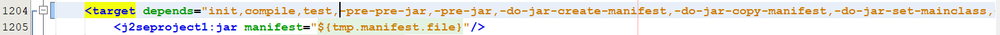
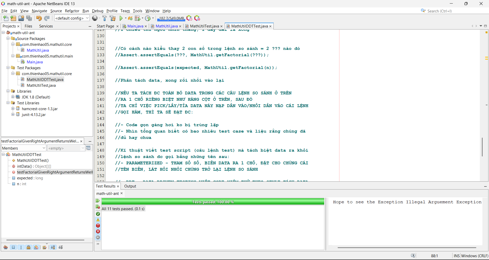

# Quy trình CI - tích hợp liên tục - Continuous Integration

- **Tích hợp (integration)**: ta chỉnh sửa, thêm bớt, bổ sung, fix bug trên code chính
  việc chỉnh sửa thêm bớt code phải đảm bảo chất lượng
  code đc chỉnh sửa và chỉnh sửa chất lượng thì sẽ đc ghi nhận
  lưu vào trong project -> TÍCH HỢP
  TÍCH HỢP: mình gom code **có chất lượng** từ anh em trong team
  gộp/ đầy lên/ upload/ lưu trữ

- **Liên tục (continuous)**: công việc gom code có chất lượng này diễn ra liên tục vì anh em
  dev team hàng ngày vẫn tiếp tục làm dự án, viết code và chỉnh sửa

**TÍCH HỢP LIÊN TỤC** NGHĨA LÀ THU GOM CODE CÓ CHẤT LƯỢNG TỪ PHÍA ANH EM
DO ANH EM HÀNG NGÀY CỨ ĂN CƠM CTY VÀ VIẾT CODE; LIÊN TỤC ĐC GOM CODE
VÀ CẤT VÀO 1 KHO LƯU TRỮ

- Thế nào là code có chất lượng ???
- Code có chất lượng là code mà các hàm/các method/class đc test kĩ càng
- Test code = cách nào:
  - dùng mắt mà dò EXPECTED == ACTUAL hay ko????
  - dùng màu XANH ĐỎ, chơi trò Unit Testing Framework

---

- Code có chất lượng là code mà các bộ test sẽ ra màu XANH, XANH cho tất cả các CASES
- khi viết code tạm xong/đang viết cx đc, chạy ngay bộ test case để xem XANH ĐỎ!!!
  => BIẾT CODE CÓ CHẤT LƯỢNG NGAY!!!

- COI NHƯ CODE ĐÃ CÓ CHẤT LƯỢNG, THÌ VIỆC TIẾP THEO LÀ ĐÓNG GÓI, .JAR, .WAR
  SẼ CẦN XUẤT HIỆN - Mặc định ANT trong NetBeans, gọi qua NB, thì quá trình đóng gói .jar, .war ko đếm xỉa, ko quan tâm
  code đang XANH hay ĐỎ, nó chỉ quan tâm, code ko ERROR về cú pháp/syntax là nó cho ra .jar .war
  - Quá trình đóng gói và quá trình XANH ĐỎ là 2 thứ độc lập nhau, ko ràng buộc!!!
    ANT qua NB chỉ tìm cách từ .jar -> .class -> .jar, ko care JUnit/Unit Test - Code đang đỏ vì JUnit, thì nó vẫn nhắm mắt cho ra .jar
    => KO ỔN, CODE ĐANG BẤT ỔN, TẠI SAO LẠI CHO RA .JAR .WAR
    VIỆC NHẸ LƯƠNG CAO, KÌ VỌNG CÓ VẤN ĐỀ

MÀU ĐỎ MÀ CHO RA .JAR, .WAR LÀ KO ỔN

- TA NÂNG CẤP THÊM QUY TRÌNH ĐẢM BẢO CHẤT LƯỢNG CODE THEO CÁCH/TƯ DUY
  - Code có chất lượng thì phải có Unit Test/Test Case đc check ra MÀU XANH
  - CHỈ CODE CÓ CHẤT LƯỢNG, CODE CÓ MÀU XANH MỚI ĐC RA FILE .JAR .WAR
    ngầm thừa nhận rằng, việc viết code ngon, sẽ đc tích hợp, đc lưu trữ lên kho chung

- TA CẦN GÀI 1 HỢP ĐỒNG NƯƠNG TỰA, KHI ĐÓNG GÓI APP, KHO GỌI ANT
  THÌ CẦN ĐẢM BẢO UNTI TEST ĐANG LÀ MÀU XANH
  UNIT MÀU ĐỎ, ANT CHỬI LUÔN, BUG RỒI, ÉO RA ĐC FILE .JAR

- Chất lượng XANH ĐỎ không chỉ đúng 1 mình mà phải tham giao vào quy trình đóng gói
- GÀI JUNIT/UNIT TEST VÀO CHƠI VỚI ANT
  file đặc biệt: build-impl.xml dòng 1005, 1030 hay 1204, 1229 tùy máy, tùy NetBeans
  sẽ giúp 2 đưa nương tựa nhau!!!

Từ mình chỉnh sửa, thì nó đã test hết tất cả các trường hợp cho mình luôn rồi

- CODE ĐẢM BẢO CHẤT LƯỢNG ĐỂ RA BẢN BUILD .JAR .WAR KO CHỈ ÁP DỤNG
  CHO TỪNG DEV MÀ PHẢI ÁP DỤNG CHUNG CHO CẢ PROJECT
  DEV NÀO CŨNG PHẢI TUÂN THỦ QUY TRÌNH NÀY!!!
  CÁC DEV THÌ ĐANG LÀM TRÊN MÁY LẺ/MÁY CỦA RIÊNG HỌ, VẬY SAO ÉP CHUGN HỌ ĐC

- TA SẼ TRIỂN KHAI VỤ ANH NƯNG TỰA, ANT + JUNIT THAY VÌ TRÊN MÁY LẺ
  CỦA TỪNG DEV, TA GOM
  - CODE CỦA CÁC DEV VỀ 1 SERVER CHUNG
  - CHẠY ANT/BUILD TOOL ĐỂ CHECK THỬ XEM TOÀN BỘ TEST CASE CỦA
  - TẤT CẢ CÁC ANH EM CÓ XANH HẾT HAY KO
  - TÍCH HỢP CODE NGON THÌ MỚI CHO
  - CI TẤT CẢ CÁC TEST CASE PASS RỒI, KO THÌ CHỬI
  - CODE LIÊN TỤC ĐƯỢC KIỂM TRA TRÊN SERVER, ĐỂ ĐẢM BẢO BIẾT ỔN HAY KO
  - XANH COI NHƯ CODE ỔN, VIỆC GOM CODE ĐÃ HOÀN THÀNH, TÍCH HỢP THÀNH CÔNG
  - ĐỎ, BỐ KHỈ, BUG RỒI, CHỬI NGAY KU DEV ĐƯA CODE ẨU!!!

## CI XUẤT HIỆN: Liên tục kiểm tra code anh em up lên để đảm bảo code màu xanh

- Khi nó nằm trên server, tích hợp code mới thành công với code cũ
- nếu đỏ, phát hiện ngay từ sớm, chửi ngay để fix
- ko muốn thấy code trên server ẩu, ko chất lượng
- code phải màu xanh trên server, tích hợp thành công các module code

* ĐỂ LÀM ĐC QUY TRÌNH NÀY, LÀM TỰ ĐỘNG LUÔN CẦN:

1. 1 kho chứa code xịn sò: Git server (GitHub, GitLab, Bitbucket...)
   Git là abstract class, interface còn 3 thằng kia là 3 thằng implement
2. Có 1 Tool, đồ chơi, 1 công cụ, lắng nghe sự thay đổi code trên server (listener)

- (Nghe xem có ku dev nào vừa đưa code lên server, push, upload)
- Lắng nghe, thấy có thay đổi, đi méc ngay Build Tool: Ant, Maven, Gradlen
  nhờ mấy Build Tool check giùm code, check luôn cả Unit Test Script

3. Check xong, thấy XANH -> im thoy
   thấy ĐỎ -> BẮN MAIL CHỬI KU VỪA UP CODE

- Tool lắng nghe: Jenkins, Bamboo CI, Team City, Circle CI, Travis CI
  - Github Actions (lớp này)

4. Git Client Tool để upload code lên server!!!

CI/CD/DevOps
