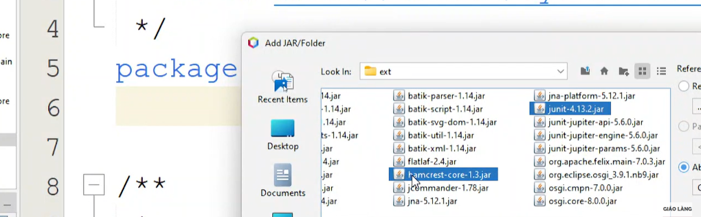
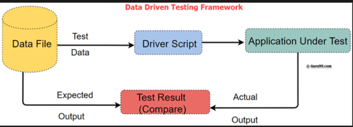
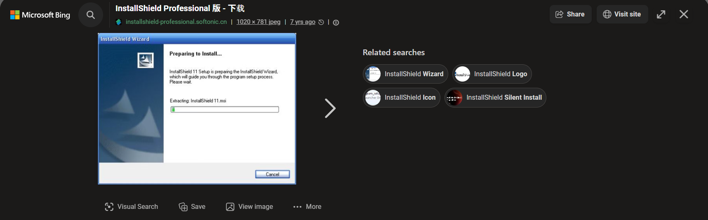
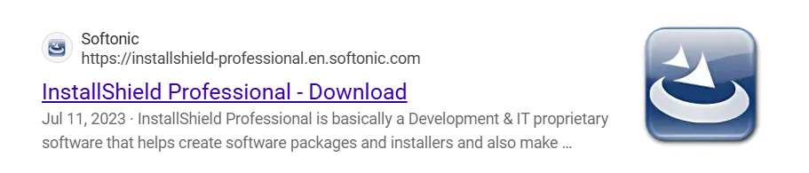
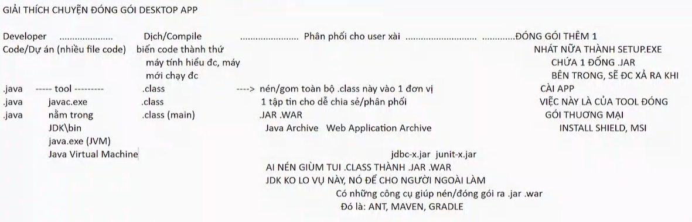
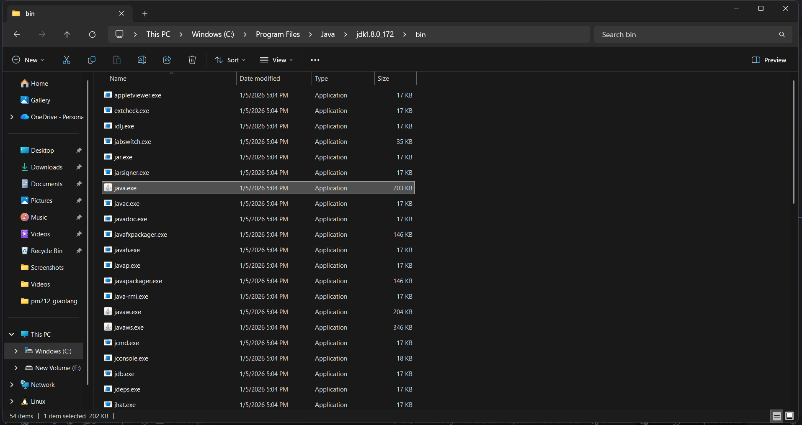
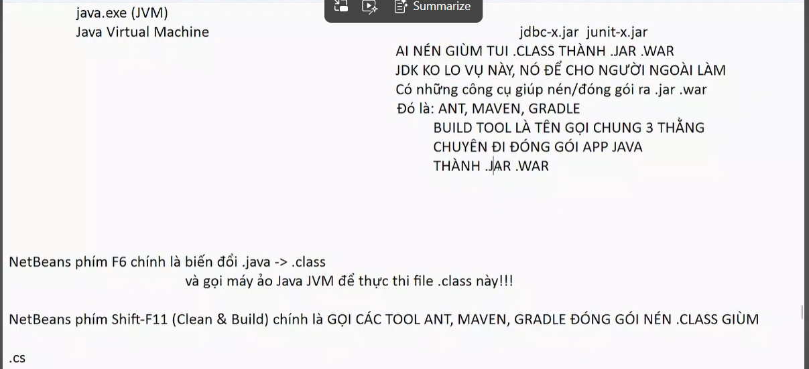
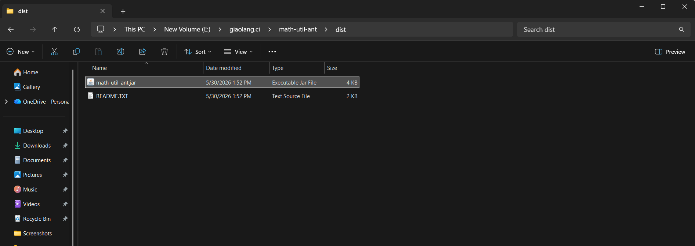
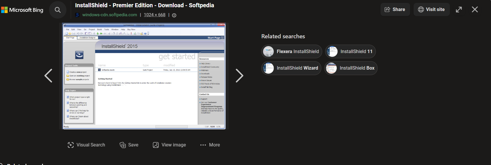

V. CÁC KĨ THUẬT/CÁC CÁCH THỨC/PHƯƠNG PHÁP CỤ THỂ ĐỂ TÌM BUG/NGĂN NGỪA BUG
Có document, có code, có app, vậy thì làm thế nào để tìm bug, ngăn ngừa bug ?

Nếu ta focus vào code/vào tiến độ hoàn thành code để hoàn thành app thì ta có 4 mức độ
4 level của việc kiểm thử

> [!NOTE]
> II. AI THAM GIA VÀO CÔNG ĐOẠN ĐẢM BẢO CHẤT LƯỢNG PHẦN MỀM???
>
> 1. DEVELOPER
>
> - Developer phải có trách nhiệm với từng đoạn code/đơn vị code mà mình viết ra!!!
>   Bức tường trong xây dựng thì được tạo nên từ những viên gạch
>   Đồ vật -> từ nguyên tử
>   Xe máy -> từ những linh kiện
>   1 app được nên từ 2 đơn vị cơ bản: - HÀM (FUNCTION/METHOD) - CLASS
>   2 đơn vị cơ bản này phải được test kĩ bởi Developer trước!!!
>   Việc kiểm thử hàm/class chạy đúng hay không, chính xác hay không được gọi là UNIT TESTING.
>   Làm thế nào, cụ thể để thực hiện thao tác kiểm thử hàm/class thì ta có nhiều cách...

- Có 4 mức độ của việc kiểm thử ứng với 4 giai đoạn hoàn thiện app/4 giai đoạn viết code level

1. UNIT TESTING LEVEL

- Developer vừa hoàn thành đc 1 hàm/1 function/1 method/ 1 class, anh ta phải có trách
  nhiệm đảm bảo rằng hàm/class/method ngon, dùng ổn, xử lý đúng đắn
  1 hàm, 1 class, 1 method đc gọi là đơn vị cơ bản của code - a unit of code
- Việc test hàm/method/class để kiểm tra tính đúng đắn của nó gọi là UNIT TEST(ING)
- Test ở giai đoạn unit/code mới hình thành thì gọi là: UNIT TESTING LEVEL
  Code/app vừa mới hoàn thiện ở mức độ đơn vị - test ngay ở mức độ này!!!
  Các thuật ngữ xuất hiện trong gia đoạn này:
- Unit Test(ing), Unit Testing Framework, Test Automation (Automated Testing), Manual Tesing
- TDD - Test Driven Development
- DDT - Data Driven Testing

- Unit Testing nó có liên quan/dây mơ rễ má với CI(Continuos Integration - tích hợp liên tục), CI dính đến CD/DevOps
  CI thì dính đến SCM/VCS:
  Git, GitHub, GitLab, Bitbucket, Jenkins, GitHub Actions
  Source Control Mannagement System
  Version Control System

2. INTEGRATION TESTING LEVEL

3. SYSTEM TESTING LEVEL

4. UAT - (USER ACCEPTANCE TESTING) LEVEL



C:\Program Files\NetBeans-13\netbeans\platform\modules\ext
[link hướng dẫn](https://youtu.be/zq6XcnZb9L0?list=PLayYhLZuuO9vPw1t2GecXHkvRfWTnaS1X&t=2150)



- BTVN - BÀI THUYẾT TRÌNH - DEMO NHÓM

* Nhóm họp với nhau, chọn ra 1 Unit Test framework ưa thích, muốn thử nghiệm, học nó, demo
* Google keyword: "Unit Test framework for <NNLT>" sẽ ra được tên FW ứng với NNLT bạn thích

* C#: NUnit, MSTest, xUnit (dùng NuGet trong Visual Studio tải về)
* Java: JUnit (tui đã làm rồi, cấm chọn lại), TestNG
* JavaScript: Mocha, Jest, Jasmine, Karma...
* Python: ...
* PHP: ...

LỊCH THUYẾT TRÌNH: THỨ 4 CỦA TUẦN THỨ 7, CÓ GHI VIDEO ĐỂ ĐƯA LÊN YT

- PHẦN NGOẠI TRUYỆN - CONTINUOUS INTEGRATION - CI - TÍCH HỢP LIÊN TỤC

Quy trình đóng gói app/sản phẩm/phần mềm

[ci_tailieu](https://github.com/doit-now/software-testing)

[devOps_tailieu](https://github.com/vietanhdo/fullstack-app-example.git)

[AI_Agent](https://github.com/Pen1112003/DEMO_PROJECT.git)





# Lấy 2 ví dụ về 2 loại app: Desktop app và Web app

## Desktop app

- **DESKTOP app** -> xài nó thì phải kiếm file `SETUP.EXE`, chạy file setup để xả cài app:

```text
GARENA.EXE
COCCOC.EXE, WORD.EXE, FIFA.EXE
IDM.EXE
```

APP NẰM TRONG FILE `SETUP.EXE`, file setup này được tạo bởi các TOOL đóng gói, ví dụ:

```text
Install Shield (setup.exe), Microsoft Installer (setup.msi)
```

---

## Web app

- **WEB app** -> xài nó thì cần biết URL để gõ, chạm đến nó

Trước đó thì app phải được cài lên server nào đó và cấu hình...

```text
JavaWeb app thì cài lên server có Tomcat, Apache HTTP Server, NGINX...
ASP .NET app thì cài lên server có IIS (Internet Information Server)
```

QUÁ TRÌNH SETUP CHẲNG QUA LÀ QUÁ TRÌNH XẢ NÉN, APP BÊN TRONG RA

HẬU TRƯỜNG CỦA WEB, CỦA APP LÀ 1 CÁI SERVER

---

# GIẢI THÍCH CHUYỆN ĐÓNG GÓI DESKTOP APP



jre là môi trường để runtime java runtime enviroment < jdk: java developement kit



javac.exe -> compiler -> biến đổi file java thành .class

java.exe chạy file class đó

Thiếu máy ảo ko chạy đc app java

Nhưng mà thiếu javac.exe -> thì ko biên dịch đc từ .java -> .class (F6 của mình)



Clean and Build thì mình sẽ ra được file .jar


Đóng gói cuối cùng là đóng gói app lại là SETUP.EXE || MSI (MICROSOFT INSTALL)

SETUP.EXE LÀ TẬP HỢP CÁI FILE .JAR

ĐÓNG GÓI LẠI XONG NHỜ THẰNG INSTALL SHEILD -> HIỆN LÊN GIAO DIỆN GIỐNG NHƯ VẬY



- Continuous Integration

- Quy trình đóng gói sản phẩm
- javac.exe -> nằm trong jdk
- Nén tất cả các file .class vào 1 đơn vị duy nhất
- file .jar, .war
- .jar đóng gói trong 1 file .exe
- dựa tool thứ 3 là Install Shield
- tool 2 là build tool
- Ant người kiến
- Ant đóng gói project, demo gọi lệnh ant

---

.jar, .war là file nén đc đóng gói nằm bên trong file setup.exe để thương mại hóa

- web app người dùng ko cần setup gì trên máy -> ko dùng tới install shield nữa
- mình phải hục máu làm cái file này lên trên server luôn

- NetBeans phím Shift-F11 (Clean & Build) chính là GỌI CÁC TOOK ANT, MAVEN, GRANDLE ĐÓNG GÓI NÉN .CLASS GIÙM
